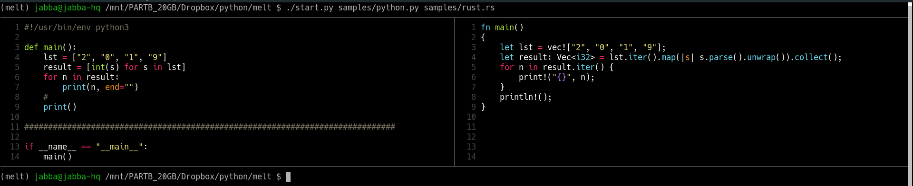
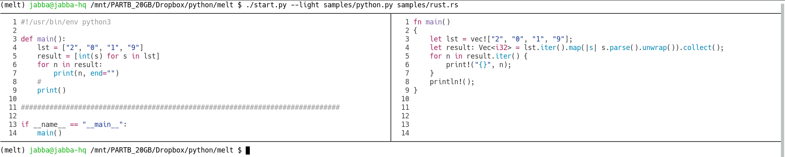

melt
====

A visual cat-like file viewer with syntax highlighting supporting 2-file views.

With melt, you can view the content of two files
that are placed side by side. The two files are
syntax highlighted separately.

Screenshots
===========

<div align="center">
  <br>
  <i>Dark background</i>
</div>

<br>
<br>

<div align="center">
  <br>
  <i>Light background</i>
</div>

Installation
============

The syntax highlighting is done with the excellent bat tool
(https://github.com/sharkdp/bat), so first you need to install bat.

Then, create a virtual environment and start using the
software:

```
$ pipenv install --dev
$ ./start.py
melt - visual cat-like file viewer with syntax highlighting supporting 2-file views

Usage: melt FILE1 FILE2 [options]

Options:

-h, --help                show this help
--light                   theme for light background

melt requires bat (https://github.com/sharkdp/bat) for the syntax highlighting
```

Creating an EXE
===============

The program was tested under Linux only. If you want to
have a standalone executable, then issue the command

    $ pynt exe

which will create the executable file `melt` in the
`dist/` folder. (Note: for this to work, follow the installation steps.)

Notes
=====

There is a similar program called [meld](https://meldmerge.org/),
which is a GUI merge and diff tool. I wanted something similar in
the terminal.
The name <i>mel**t**</i> indicates that it is
similar to meld but it is made for the **t**erminal.

I wanted a tool that can show two files side by side in
the terminal using syntax highlighting. melt is not
made for merging and showing diffs, it is just a file
viewer with two panels. A great advantage of melt is that
the two files can have different extensions and thus
they will be colored differently.
